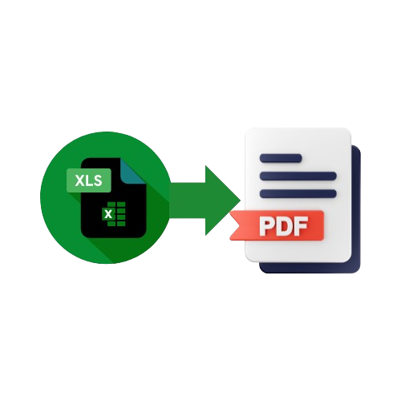

 

  

  <h3 align="center">Best-README-Template</h3>

  

    An awesome README template to jumpstart your projects!
     
    <a href="https://github.com/othneildrew/Best-README-Template"><strong>Explore the docs »</strong></a>
     
     
    <a href="https://github.com/argho1/stickeyBusiness">View Demo</a>
    ·
    <a href="https://github.com/argho1/stickeyBusiness/issues/new?labels=bug&template=bug-report---.md">Report Bug</a>
    ·
    <a href="https://github.com/argho1/stickeyBusiness/issues/new?labels=enhancement&template=feature-request---.md">Request Feature</a>
  

